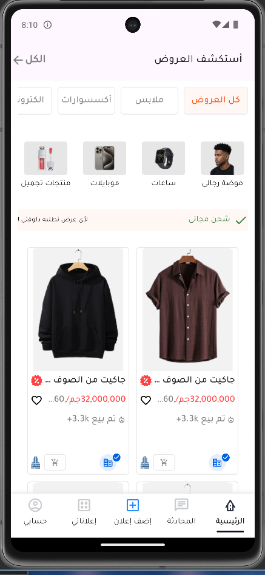
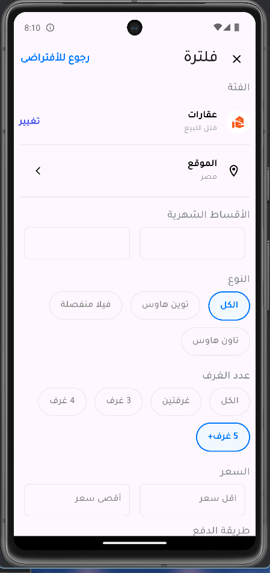
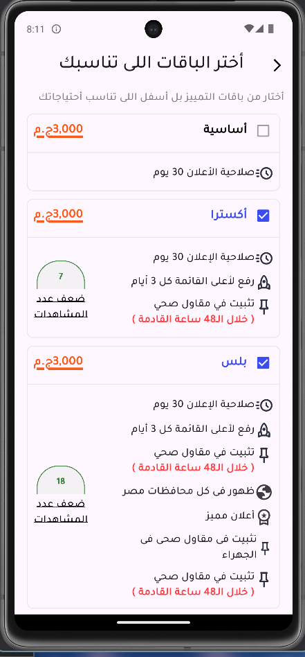

# Menna Task

Menna Task is a Flutter mobile application (Dart) with a small amount of iOS-specific code. This README documents the technologies used, recommended project organization, a simple design system, and exact instructions for adding design screenshots into assets/screenshots so your repository and deliverables look professional.

---

## Quick summary
- Platform: Flutter (Dart)
- Primary language: Arabic (RTL) but app supports English locales
- Local storage: SQLite via sqflite
- Responsive sizing: flutter_screenutil
- Icons: flutter_svg
- Fonts: google_fonts (Tajawal)
- Directory for screenshots (requested): assets/screenshots

---

## Technologies (found in the code / pubspec.lock)
- flutter
- dart
- flutter_screenutil
- sqflite (+ platform packages)
- flutter_svg
- google_fonts
- flutter_localizations
- path, path_provider, http (utility packages)

Check pubspec.yaml / pubspec.lock for exact versions.

---

## Recommended repository structure
- android/
- ios/
- lib/
  - main.dart
  - core/
    - constants/
      - app_assets.dart
      - app_color.dart
      - app_sizes.dart
      - app_style.dart
    - theme/                ← add AppTheme here (ThemeData)
    - services/             ← database_helper.dart
    - widgets/              ← reusable widgets (ProductCard, PrimaryButton...)
  - screens/
    - main_screen.dart
    - home_screen.dart
    - profile_screen.dart
    - filter_screen.dart
  - models/
    - product.dart
- assets/
  - images/
  - icons/
  - screenshots/           ← REQUIRED: place screenshot1/2/3 here
- test/
- pubspec.yaml
- README.md
- LICENSE (if any)
- CONTRIBUTING.md (optional)

Naming:
- Files: snake_case (home_screen.dart)
- Classes & Widgets: PascalCase (HomeScreen)

---

## Design system (practical & minimal)
Make the app visually consistent and easy to update by centralizing tokens and using ThemeData.

1) Design tokens
- Colors: convert AppColors to static const values (e.g., AppColors.blue).
- Sizes: keep AppSizes but expose semantic names (spacingSmall, spacingMedium).
- Text styles: centralize in AppStyles and mirror them in ThemeData.textTheme.

2) Theme
- Add lib/core/theme/app_theme.dart with a function/class that returns ThemeData for the app:
  - colorScheme, textTheme (GoogleFonts.tajawal), elevatedButtonTheme, inputDecorationTheme, iconTheme.
- Use theme: AppTheme.light(context) in MaterialApp.

3) Typography
- Use semantic names: headlineLarge, title, body, caption. Example sizes in AppStyles already use Tajawal via google_fonts — map those into the theme.

4) Spacing & Radii
- Adopt a spacing scale: 4 / 8 / 12 / 16 / 24 / 32.
- Use a small set of radii: 4 / 8 / 16 / 32.

5) Components
- Create configurable, reusable components:
  - PrimaryButton
  - SecondaryButton
  - CategoryChip
  - ProductCard (already exists — refactor props to accept variants)
  - AppBar components and list item components

6) Accessibility & UX
- Ensure tappable targets >= 48x48dp.
- Check color contrast for text against backgrounds.
- Provide semantic labels for interactive elements (for screen readers).

7) Motion
- Keep micro-interactions subtle (AnimatedPositioned, Hero for transitions).

---


## Screenshots









---

## Database & data seeding
- Local DB: lib/core/services/database_helper.dart (sqflite) — table `products` (id, name, price, soldNumber, image).
- Product model: lib/models/product.dart (toMap / fromMap).

---


## How to run & build
Development:
1. flutter pub get
2. flutter devices
3. flutter run

Build:
- Android APK: flutter build apk --release
- Android AAB: flutter build appbundle --release
- iOS: flutter build ios --release (requires macOS/Xcode; set signing via Xcode)

Testing:
- flutter test
- flutter analyze

---

## Suggested immediate tasks I can help with
(If you want me to implement any of these, tell me which and I will prepare the file content for you to commit.)
- Add a Design section into README (done here).
- Create lib/core/theme/app_theme.dart (ThemeData scaffold).
- Convert AppColors to static const and update usages.
- Add assets/screenshots placeholders (3 PNGs) and update pubspec.yaml.
- Add a small seed JSON and the seed loader to populate products.db.

---

## Final notes
- The app already uses a consistent constants structure (app_assets, app_sizes, app_style). Converting them to static tokens and introducing ThemeData will make maintenance and design changes much easier.
- When you're ready, add the three screenshots to assets/screenshots and paste them into the README using the example snippet above. If you want, tell me which immediate task to prepare (e.g., create theme file or create placeholders) and I will produce the exact file contents you can commit.

```
